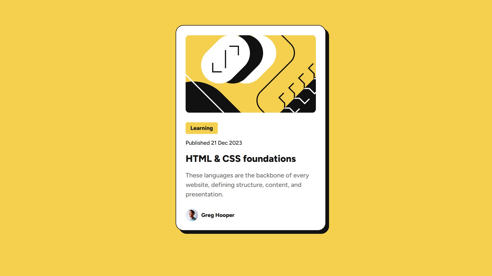

# Frontend Mentor - Blog preview card solution

This is a solution to the [Blog preview card challenge on Frontend Mentor](https://www.frontendmentor.io/challenges/blog-preview-card-ckPaj01IcS). Frontend Mentor challenges help you improve your coding skills by building realistic projects. 

## Table of contents

- [Overview](#overview)
  - [The challenge](#the-challenge)
  - [Screenshot](#screenshot)
  - [Links](#links)
- [My process](#my-process)
  - [Built with](#built-with)
  - [What I learned](#what-i-learned)
  - [Continued development](#continued-development)
  - [Useful resources](#useful-resources)
- [Author](#author)

**Note: Delete this note and update the table of contents based on what sections you keep.**

## Overview

### The challenge

Users should be able to:

- See hover and focus states for all interactive elements on the page

### Screenshot



### Links

- Solution URL: [GitHub Repo](https://github.com/wolverwin/blog-preview-card-main)
- Live Site URL: [GitHub Pages](https://wolverwin.github.io/blog-preview-card-main/)

## My process

### Built with

- Semantic HTML5 markup
- Flexbox
- SASS

### What I learned

I learned how to better use the Flexbox layout and how to implement responsive text without a media query.

```scss
@mixin text-preset-1 {
  font: clamp(20px, 4vw, 24px)/150% "Figtree Extra Bold", sans-serif;
  letter-spacing: 0;
  color: $gray-950;
  text-decoration: none;
}
```

### Continued development

In future projects I hope to develop my SASS skills further.

### Useful resources

- [Dai Codes](https://blog.dai.codes/responsive-css-without-media-queries/) - This page helped me find out more about responsive CSS without media queries.

## Author

- Frontend Mentor Profile - [@wolverwin](https://www.frontendmentor.io/profile/wolverwin)
